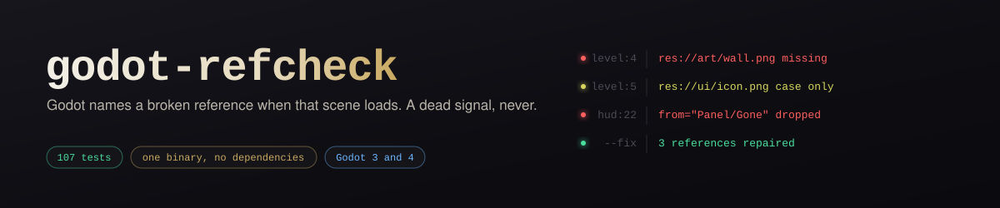
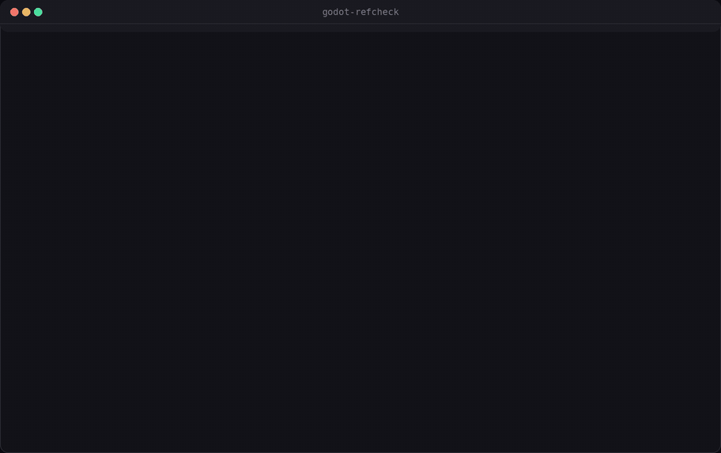

# godot-refcheck

**Find broken resource references in a Godot project without opening the editor — and repair the ones that have a single provable answer.**

[](https://github.com/Furkiozknn/godot-refcheck/actions/workflows/ci.yml)
[](https://github.com/Furkiozknn/godot-refcheck/releases/latest)
[](LICENSE)
[](Cargo.toml)



<sub>Real output from <code>tests/projects/moved</code>, a fixture in this repository: an asset folder was moved and the references were not. Three findings, three repairs, then a clean run. The engine agrees — <code>tools/verify_with_godot.py</code> hands the same project to a headless Godot before and after.</sub>

A scene loses a texture, a script preloads a file somebody renamed, two copied
files end up with the same `uid://`, a folder is `Art/` on one machine and
`art/` on another. Godot only tells you when that particular scene is loaded —
often in an exported build, on someone else's computer, long after the commit
that broke it.

`godot-refcheck` reads the project files directly, resolves every reference the
way the engine does, reports the ones that cannot be satisfied, and repairs the
ones that have a single provable answer. It is a single binary with no runtime
dependencies, it never launches the engine, and fifteen thousand files are
scanned in about three seconds.

```
$ godot-refcheck tests/projects/broken --fail-on never
godot-refcheck 0.1.0  tests/projects/broken

main.gd:3: error: missing-resource: res://nope.tscn is not in the project
    preload/load
main.tscn:1: error: duplicate-uid: uid://cbrokensceneaa is claimed by 2 files
    res://main.tscn, res://twin.tscn
main.tscn:4: error: missing-resource: res://art/absent.png is not in the project
    ext_resource (Texture2D)
main.tscn:5: error: case-mismatch: res://Art/Present.PNG does not exist; the file on disk is res://art/present.png
    ext_resource (Texture2D) - loads on Windows and macOS, fails on Linux and in exported builds
main.tscn:17: error: undeclared-id: ExtResource("99") has no matching declaration
    the file declares no ExtResource with id 99
project.godot:7: error: unknown-uid: uid://cnobodyhasthisu matches no file in the project and no path is given
    project setting (application/config/icon)
project.godot:12: error: missing-resource: res://missing_autoload.gd is not in the project
    project setting (autoload/Gone)
twin.tscn:1: error: duplicate-uid: uid://cbrokensceneaa is claimed by 2 files
    res://main.tscn, res://twin.tscn
art/deleted.png.import:1: warning: stale-import: import metadata left over from res://art/deleted.png, which is gone
    delete the .import file, or restore the asset
moved.tres:3: warning: uid-path-mismatch: uid://cpresentaaaaaa resolves to res://art/present.png, but the reference spells the path as res://art/old_name.png
    ext_resource (Texture2D)

8 files, 8 references: 8 errors, 2 warnings, 0 notes.
```

## What it checks

| check | level | what it means |
| --- | --- | --- |
| `missing-resource` | error | a referenced `res://` file is not in the project |
| `case-mismatch` | error | the reference differs from the file on disk only by letter case, so it works on Windows and macOS and fails everywhere else |
| `unknown-uid` | error | a `uid://` reference matches no file and has no usable path to fall back on |
| `duplicate-uid` | error | two files claim the same `uid://`, so the engine may hand out the wrong one |
| `undeclared-id` | error | a scene uses `ExtResource("3")` or `SubResource("x")` that the file never declares |
| `broken-connection` | error | a signal is connected from or to a node the scene does not contain; the engine drops such a connection without a word, so the callback simply stops arriving |
| `missing-node-path` | error | a script reaches for `$Head/Body` (or `get_node("Head/Body")`) that the scene it runs in does not contain; the engine hands back `null` and the next line dies at run time, on whichever branch gets there first |
| `duplicate-class-name` | error | two scripts declare the same global `class_name` |
| `uid-path-mismatch` | warning | the `uid://` and the path in one reference point at different files; the engine follows the uid and ignores the path you read |
| `stale-import` | warning | a `.import` file left behind by an asset that was deleted or renamed |
| `unused-asset` | note | nothing in the project appears to reference this asset (opt-in, advisory) |

`missing-node-path` exists because most projects do not connect signals in the
editor at all. The four games in this ecosystem have **no** `[connection]`
blocks and 145 `.connect(` call sites in GDScript, so the resolver that judges
a connection's `to=` was pointed at a file section they never write. `$Head/Body`
is the same claim in the place it is actually made.

It is quiet by construction, and each rule below is there because leaving it
out produced findings on code that ships:

- A script no scene attaches is skipped. An autoload or a `RefCounted` helper
  has no tree to be judged against.
- A script attached to several scenes is reported only if the path is missing
  in **every** one of them.
- The path resolves from the node the script is attached to, not from the
  scene root: `$Sprite` on a child means that child's `Sprite`.
- `oyun.get_node("Dunya/Oyuncu")` asks another node and is ignored. Counting
  it produced 132 findings on one shipped game — all of them a headless test
  harness reaching into a scene it had just instantiated.
- A node some script names at run time (`alet.name = "Aletler"` then
  `add_child`) is never called missing. That was the last false positive left
  across five real projects, and it was in a game that works.

Across the five Godot projects on this account — 850-odd files — it reports
nothing. That is the result it should give on code that runs; the fixture
under `tests/projects/nodepath` is where it is proved to bite.

References are collected from `.tscn`, `.tres`, `.escn`, `project.godot`,
`.import`, `plugin.cfg`, `.gd`/`.cs` (`preload()` and `load()` with a literal
argument, `extends "res://…"`, `@icon("res://…")`) and `.gdshader` (`#include`).
Godot 3 and Godot 4 project formats are both understood.

Node paths are resolved through the whole scene graph, so a connection into an
instanced sub-scene, into a scene this one inherits from, or under an
`instance_placeholder` is understood rather than guessed at.

## Install

**Download a binary** — Linux, macOS (Intel and Apple Silicon) and Windows
builds are attached to every [release](https://github.com/Furkiozknn/godot-refcheck/releases).
Unpack it and put `godot-refcheck` on your `PATH`.

**With cargo**

```sh
cargo install --git https://github.com/Furkiozknn/godot-refcheck
```

**From source** — needs a Rust toolchain and nothing else:

```sh
git clone https://github.com/Furkiozknn/godot-refcheck
cd godot-refcheck
cargo build --release      # target/release/godot-refcheck
```

## Use

```sh
godot-refcheck                     # the project in the current directory
godot-refcheck path/to/project     # a directory, or the project.godot itself
godot-refcheck . --unused          # also list assets nothing references
godot-refcheck repos --recursive   # every project.godot under a directory
godot-refcheck . --json            # machine-readable
godot-refcheck . --sarif out.sarif # for GitHub code scanning
godot-refcheck . --only duplicate-uid,case-mismatch
godot-refcheck . --skip stale-import --fail-on warning
godot-refcheck . --fix                 # repair what can be proved, in place
godot-refcheck . --fix-dry-run         # show those repairs, change nothing
godot-refcheck . --write-baseline refcheck-baseline.txt
godot-refcheck . --baseline refcheck-baseline.txt
```

Exit codes: `0` nothing at or above `--fail-on` (default `error`), `1`
something was found, `2` the project could not be read.

## Repairing what can be proved

A missing reference usually has exactly one possible answer: the file is still
there under a different spelling, the `uid://` already resolves somewhere, or
exactly one file in the project carries that name. `--fix` applies those and
leaves everything else alone. It never guesses: two files with the same name
mean no repair, and a path written with a locale suffix or a `..` step is left
for a person.

```
$ godot-refcheck ~/games/moved --fix
repaired 3 references
  level.gd:3  res://scenes/player.tscn -> res://player.tscn
      res://player.tscn is the only file named player.tscn (missing-resource)
  level.tscn:4  res://art/wall.png -> res://art/tiles/wall.png
      res://art/tiles/wall.png is the only file named wall.png (missing-resource)
  level.tscn:5  res://ui/icon.png -> res://ui/Icon.png
      the file on disk is spelled that way (case-mismatch)
```

`--fix-dry-run` prints the same list and changes nothing. Repairs are
single-line, in-place edits: line endings, ordering and every other byte of the
file stay as they were. Nothing is ever deleted - a leftover `.import` file is
reported, never removed.

## Adopting it on a project that already has findings

```sh
godot-refcheck . --write-baseline refcheck-baseline.txt   # once
godot-refcheck . --baseline refcheck-baseline.txt         # from then on
```

The baseline is a sorted, tab-separated text file that diffs and merges like the
rest of the repository. It records the check, the project, the file and the
message, but deliberately not the line number, so editing the lines above a
finding does not wake it up again. New problems still fail the build on the day
they appear.

## In CI

The repository ships a composite action, so a workflow needs three lines:

```yaml
name: godot-refcheck
on: [push, pull_request]

jobs:
  refcheck:
    runs-on: ubuntu-latest
    steps:
      - uses: actions/checkout@v7
      - uses: Furkiozknn/godot-refcheck@v0.1.0
        with:
          path: .
```

Inputs: `path`, `recursive`, `unused`, `only`, `skip`, `fail-on`, `sarif`,
`fix`, `fix-dry-run`, `baseline`, `version`. Outputs: `errors`, `warnings`,
`notes`, `findings`, `repaired`.

With `sarif: refcheck.sarif` the findings can be uploaded to GitHub code
scanning and appear inline on the changed lines of a pull request:

```yaml
      - uses: Furkiozknn/godot-refcheck@v0.1.0
        with:
          sarif: refcheck.sarif
          fail-on: never
      - uses: github/codeql-action/upload-sarif@v4
        with:
          sarif_file: refcheck.sarif
```

## Why the results can be trusted

A checker that cries wolf gets switched off, so every rule here had to earn its
place against real projects and against the engine itself.

**The engine is the reference.** `tools/verify_with_godot.py` runs a real
headless Godot over the fixture projects and compares what the engine prints
with what `godot-refcheck` reports. Eight cases have a matching engine message.
The rest are listed as static-only with the reason the engine stays silent, and
one fixture exists purely to show the engine accepting a project that is broken.
Two round trips close the loop: a fixture and a real demo are broken by moving
folders, repaired with `--fix`, and handed back to the engine, which then has
nothing to say.

```
$ python3 tools/verify_with_godot.py --download --real ../godot-demo-projects/2d/dodge_the_creeps
godot 4.4.1-stable as the reference implementation

  [ok] broken   missing-resource   engine=yes refcheck=yes
  [ok] broken   missing-resource   engine=yes refcheck=yes
  [ok] broken   missing-resource   engine=yes refcheck=yes
  [ok] broken   case-mismatch      engine=yes refcheck=yes
  [ok] broken   duplicate-uid      engine=yes refcheck=yes
  [ok] broken   unknown-uid        engine=yes refcheck=yes
  [ok] scripts  missing-resource   engine=yes refcheck=yes
  [ok] scripts  duplicate-class-name engine=yes refcheck=yes

  [static-only] broken-connection  the engine drops a connection it cannot resolve without a word, so the signal simply stops arriving
  [static-only] stale-import       leftover import metadata is ignored rather than reported
  [static-only] uid-path-mismatch  the engine silently prefers the uid and never mentions the stale path
  [static-only] undeclared-id      the engine only reports it when that particular scene is loaded
  [static-only] unused-asset       advisory; the engine has no notion of an unused asset

  [ok] clean    healthy project: engine errors=0 refcheck findings=0
  [ok] tricky   healthy project: engine errors=0 refcheck findings=0
  [ok] legacy3  healthy project: engine errors=0 refcheck findings=0

  [ok] conn     the engine is silent, refcheck is not: engine errors=0 broken-connection=2 other=0

  [ok] moved    repair round trip: engine errors before=17 after=0, refcheck findings after=0

  [ok] dodge_the_creeps: moved 2 folders, 13 references went stale, 0 left after --fix, engine errors after=0

8 engine-confirmed cases, 3 healthy projects, 1 case the engine keeps quiet about and one repair round trip: all matched.
```

**Working projects are the other reference.** `tools/corpus.py` scans eleven
real repositories — 237 projects, 19,305 files, 6,904 references, 2,741 signal
connections and 880 `class_name` declarations. It reports 41 findings in total,
every one of them checked by hand and real; nothing else in those projects
produces a finding, and `--fix-dry-run` proposes no change anywhere in them.
[docs/corpus.md](docs/corpus.md) lists each one. Shapes that look broken and are
not — a connection into an instanced or inherited scene, locale-suffixed
translation remaps, translations generated from a `.csv` at import time, the
dead `[locale]` block Godot 3 leaves behind,
`load("res://levels/%s.tscn" % name)`, sub-resource paths, Godot 3's
`ExtResource( 1 )` — are all carried in the test suite as named regression
tests, because each of them once produced a false finding here.

`cargo test` runs 107 tests, all offline.

## Limitations

- A path built at run time (`load("res://levels/" + name + ".tscn")`,
  `get_node("lvl" + n)`) cannot be resolved statically and is deliberately
  ignored rather than guessed at.
- A node created with `add_child` at run time is in no scene file. If some
  script names it (`n.name = "Aletler"`), `missing-node-path` stays silent
  about paths reaching that name anywhere in the project — which is coarse,
  and deliberately so: a false error in a tool like this costs more than a
  missed one.
- `$"quoted"` and `%UniqueName` are not judged: the first can hold anything,
  and the second is resolved by owner rather than by path.
- `unused-asset` is advisory and off by default: an asset reached only through a
  computed path looks unused to any static tool. Scripts are never reported,
  because a `class_name` can be used with no `res://` reference at all.
- Project settings are only followed inside sections the engine itself defines,
  so a custom section cannot produce a false error.
- Whether a connected method exists is not checked: a signal may legitimately be
  wired to a built-in method such as `queue_free` or `set_h_offset`, and only the
  engine knows the full class API.
- C# is read for `preload`/`load` calls only; it is not parsed as C#.

## Development

```sh
cargo test                                   # 128 tests, no network
cargo clippy --all-targets -- -D warnings
cargo fmt --check
python3 tools/verify_with_godot.py --download
python3 tools/corpus.py
```

## License

MIT — see [LICENSE](LICENSE).

---

## More from this ecosystem

- **[repo-vet](https://github.com/Furkiozknn/repo-vet)** — checks what a README promises against what is actually there
- **[mcp-vet](https://github.com/Furkiozknn/mcp-vet)** — audits an MCP server's source before you install it
- **[godot-2d-sablon](https://github.com/Furkiozknn/godot-2d-sablon)** — two Godot 4 starters whose jump feel was measured
- **[yercekimi-cevir](https://github.com/Furkiozknn/yercekimi-cevir)** — no jump button — one key flips gravity

<sub>All of them in one searchable page: **[furkiozknn.github.io](https://furkiozknn.github.io/)** — each card is generated from that repository's own <code>project-meta.json</code>.</sub>
